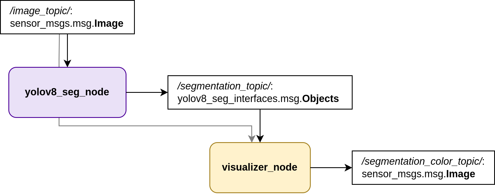
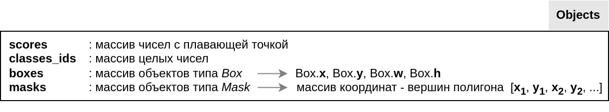
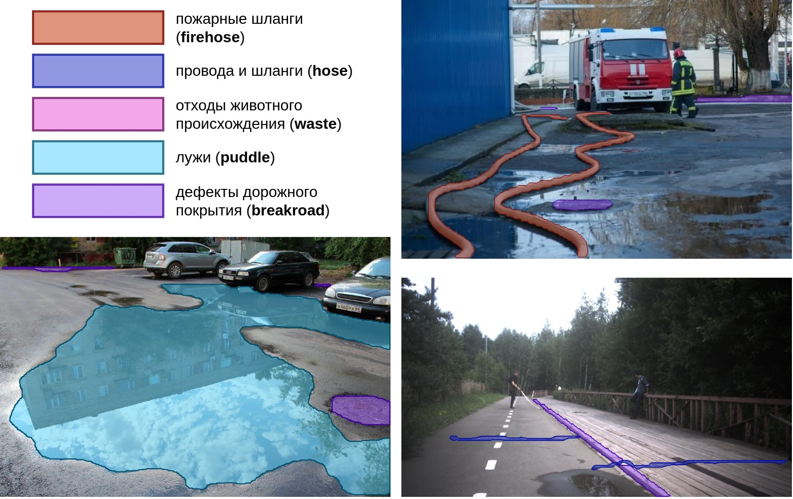

Репозиторий содержит ROS2 (Humble) интерфейс для работы с YOLOv8 на Jetson (версия JetPack 5).
Dockerfile.aarch64, предназначенный для сборки на Jetson, наследуется от образа [jetson-ros2-ultralytics:latest-humble](https://hub.docker.com/repository/docker/ritaakichik/jetson-ros2-ultralytics/general), исходные файлы для сборки которого доступны в папке docker/docker_humble.
Dockerfile для сборки ROS2 Foxy также представлен в папке docker.


Представленные инструкции позволяют собрать 2 узла:
- __yolov8_seg_node__, который слушает топик с изображениями и отправляет результаты сегментации в топик _segmentation_topic_ (формат определяется пакетом _yolov8_seg_interfaces_);
- __visualizer_node__, который слушает топики _image_ и _segmentation_ и визуализирует результаты сегментации, отправляя изображения в _segmentation_color_topic_.

На следующем изображении приведена диаграмма совместной работы узлов:


Тип _Objects_ - пользовательский, он определён в _yolov8_seg_interfaces_. Ниже приведена структура этого типа.


Пример визуализации __visualizer_node__ приведён ниже с расшифровкой цветовых кодов классов объектов.


## Сборка образа
```bash
cd docker
sudo ./build.sh
./start.sh
./into.sh
```

## Работа с пакетом

Сборка пакета:
```bash
cd /colcon_ws
colcon build --packages-select yolov8_seg_ros2 yolov8_seg_interfaces --symlink-install
source install/setup.bash
```
В папку weights пакета _yolov8_seg_ros2_ необходимо положить веса, например из  [папки с весами, полученными на датасете с препятствиями](https://disk.yandex.ru/d/-3Nz15ePPFSZiQ).

Запуск launch (необходимо специализировать namespace камеры, имя топика с изображениями и путь к весам модели):
```bash
ros2 launch src/yolov8_seg_ros2/launch/yolov8_seg_launch.py camera_ns:="/sensum/left/" image_topic:=image_raw weights:="src/yolov8_seg_ros2/weights/roboseg_S_5_cats.pt"
```
